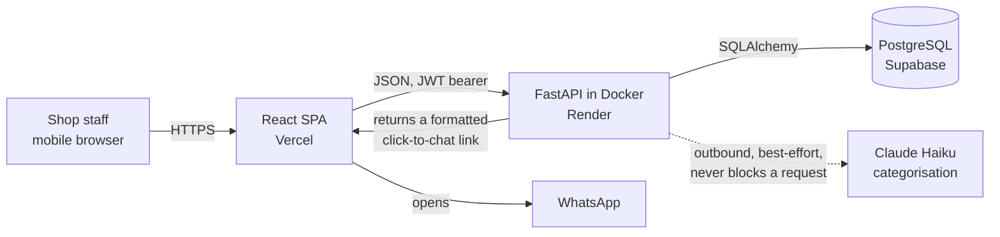
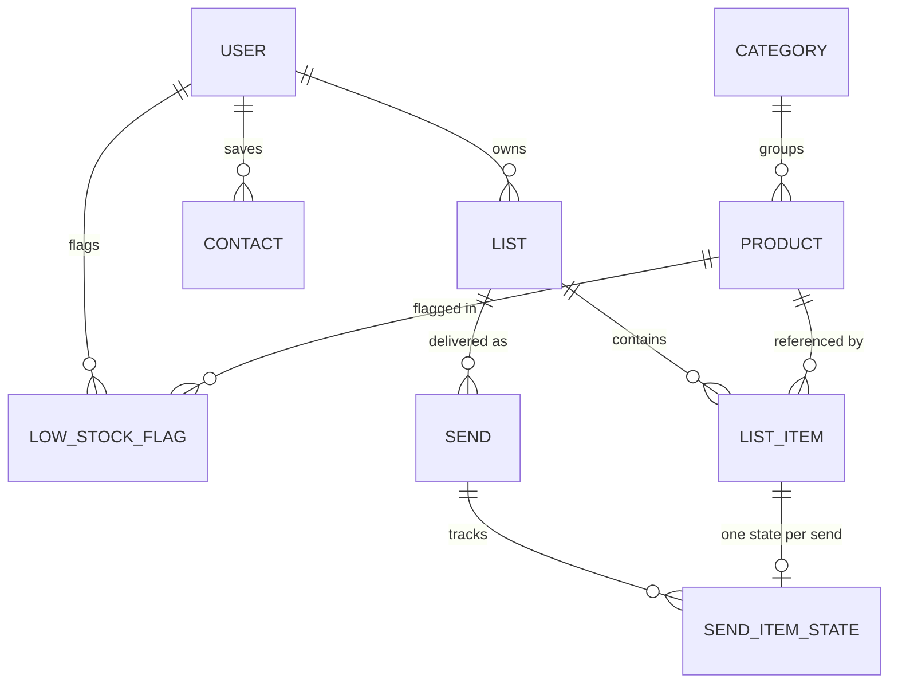

# Watchlist

Watchlist is a catalog, list-building and ordering tool for a phone and electronics repair shop. Staff keep a shared product catalog, flag items that are running low, assemble restock lists on their phones, and send those lists to colleagues and suppliers. I proposed and built it while working IT support at the shop — it wasn't assigned — to replace ad-hoc text messages that got lost in conversation and left no record of what had been asked for or what came back. It is deployed and in intermittent real use by 3–5 staff against a catalog of roughly 150 products. Roughly four months of work, ~80 commits, May–August 2026.

**The source is private.** This repository is a written account of the design and the decisions behind it.

---

## What it does today

Everything in this section is built, deployed, and exercised. Things that are built but are not the primary real-world path are marked as such; things that don't work are in [Known limitations](#known-limitations).

**Catalog**

- Shared product catalog, roughly 150 items in production.
- Search that normalises whitespace, so `iphone15case` matches "iPhone 15 Case".
- User-managed categories with drill-down, rename, delete, and manual re-assignment. Deleting a category moves its products to uncategorised rather than deleting them.
- Colour tags — six fixed colours, applied to many products at once from a multi-select, rendered as a thin bar on the leading edge of the row.
- Soft delete and restore. Nothing in the catalog is ever hard-deleted.

**Lists and low stock**

- Per-user "running low" flags on catalog products, and a screen showing only what's flagged.
- Lists holding either catalog products or free-text items, with quantities.
- Adding an item is idempotent per list: adding the same product twice returns the existing row instead of duplicating it.
- Marking items received automatically clears the corresponding low-stock flags.

**Sending**

- A list can be sent to several recipients in one action, resolved from saved contacts or a typed phone number. Each recipient succeeds or fails independently, and the result is reported per recipient.
- **WhatsApp deep links are the path actually used in practice.** The backend formats the list — title, quantities, names, and for a quote the unit prices and running total — and returns a click-to-chat link that the client opens.
- **The in-app inbox and quoting flow are built and tested, but are not the primary real-world path.** A registered recipient sees sends in an inbox, checks items off, records received quantities, prices items, and submits a quote; the sender then sees submitted quotes with per-line and total figures. In day-to-day use, sharing goes out over WhatsApp instead.

**Accounts**

- Phone-number and password accounts, JWT bearer auth, 30-day tokens.
- Registration backfills history: sends and contacts addressed to a phone number before it had an account are linked to the new user on signup.

---

## Architecture

### Deployment and request flow

The SPA is static on Vercel and talks to the API over JSON with a bearer token. The container runs migrations on boot, then serves the app, so a deploy cannot serve code that is ahead of its schema. WhatsApp is never called server-side — the backend only *builds* the message text and hands the link to the client, which opens it.

### Data model

Three things about this model are worth calling out, because they are where the design actually lives:

**A send is a delivery, not a copy.** `Send` records that a list went to a phone number. `SendItemState` holds the *recipient's* progress on that send — checked, received quantity, unit price. A recipient can never mutate the sender's list, and several recipients hold independent state against the same list.

**Recipients don't have to exist yet.** The recipient phone number is always stored; the recipient user is nullable. A list sent to an unregistered number is recorded against the number, and linked to a real account if that number ever registers.

**A quote has no table.** A quote is a send with a submission timestamp set, plus prices on its item states. Quote lines are computed live from the current list. That is a deliberate tradeoff, covered in [Known limitations](#known-limitations). The only price column in the entire schema is an integer-cents unit price on the send item state — there is no money anywhere in the catalog.

Schema changes go through Alembic; there are 13 migrations. They are generated in batch mode so one set of scripts stays valid on both SQLite locally and Postgres in production.

---

## Tech stack

| Layer | Choice | Why |
|---|---|---|
| API | FastAPI | Pydantic request/response models give validated, typed boundaries and a live OpenAPI schema without extra work. |
| ORM | SQLAlchemy 2.0, typed `Mapped` style | The data is heavily relational — lists, sends, per-recipient item state — and the typed style catches model mistakes before runtime. |
| Migrations | Alembic | The app runs on SQLite locally and Postgres in production; batch-mode migrations keep one set of scripts valid on both. |
| Database | PostgreSQL (Supabase) in production, SQLite locally | Managed Postgres with no ops burden; SQLite keeps the test suite fast and network-free. |
| Frontend | React 19 + Vite + TypeScript | `tsc -b && vite build` is the real verification gate for the frontend — it must pass with zero type errors. |
| UI | Tailwind v4, shadcn-style components on Base UI | Components live in the repo and are edited directly rather than configured through a library API. These are Base UI primitives, not Radix. |
| Container | Docker on Render | Migrations run on container start, binding a deploy to its schema. |
| Static hosting | Vercel | SPA rewrites so client-side routes resolve on deep links. |
| Tests | pytest + Vitest | 298 tests. See [Testing](#testing). |

---

## Engineering decisions

Five decisions with tradeoffs I knowingly took. Each is a real change in the history, not a retrospective rationalisation.

### 1. Per-recipient isolation instead of an atomic send

**Problem.** Sending one list to several recipients committed each recipient inside a loop. If the third recipient failed — say, an unregistered number asked for in-app inbox delivery — the exception aborted the request *after* recipients one and two had already been committed. The caller saw a total failure, re-sent, and everyone who had already received the list got it twice. In a shop where a duplicate order costs money, that is the worst available failure mode.

**Options.** (a) Wrap all recipients in one transaction so it is genuinely all-or-nothing. (b) Validate every recipient up front, then commit. (c) Isolate each recipient and report per-recipient results.

**Choice.** (c). Each recipient is committed on its own; a failure rolls back only that recipient's partial work and is recorded as a failed result rather than raised. The endpoint returns one result per recipient. The all-failed case still raises, so existing clients keep treating total failure as an error. The UI reports partial success honestly — per-recipient status and reason, and a warning rather than a failure toast.

**Tradeoff accepted.** The endpoint is no longer atomic, and callers must read a result array instead of trusting the status code. I took that because "some recipients got it, and you can see exactly which" is strictly better for this workflow than "all or nothing, and we are not sure which." Option (a) sounds cleaner but does not survive contact with the actual failure: the request had already partially succeeded by the time anything knew it had failed.

### 2. LLM categorisation that fails open

**Problem.** Products get typed in on a phone, quickly, and nobody categorises them. Automatic categorisation is genuinely useful, but it sits directly in the create-product request path, and a model call is a network dependency that can be slow, rate-limited, or down.

**Options.** (a) Categorise inline and surface failures to the user. (b) Queue categorisation to a background worker. (c) Categorise inline, best-effort, and swallow every failure.

**Choice.** (c), with the failure mode designed first. One attempt, no retries, a five-second ceiling, and a catch-all that logs and returns nothing. Missing key, kill switch, network error, timeout, unparseable response — all produce the same outcome: the product is created uncategorised. There is deliberately no startup guard on the API key, because a missing key must never stop the app booting. Categorisation runs only on genuinely new products; the idempotent "this product already exists" path never re-categorises.

**Tradeoff accepted.** Silent failure. When it does not work, nothing tells the user — products quietly arrive uncategorised and only the logs know why. That is exactly what is happening in production right now (see [Known limitations](#known-limitations)): the key is configured, the feature is not working, and because it fails open the rest of the app is unaffected. I would make the same call again — an uncategorised product is a minor annoyance, a create button that hangs for five seconds is not — but the honest cost is that the feature can be dead for a while before anyone notices. A visible operator signal is on the roadmap.

One model-behaviour decision inside this is worth noting: the prompt's stated top priority is determinism, not accuracy. The same product name must always land in the same category, so the rules key strictly on product *type* and explicitly ignore the device model in the name. A categoriser that is right 95% of the time but inconsistent produces a catalog nobody trusts.

### 3. Soft delete everywhere, and data scripts that are dry-run first

**Problem.** Catalog products are referenced by list items, by low-stock flags, and transitively by every recipient's check-off state on past sends. A hard delete either breaks those references or silently destroys someone's history. Separately, I needed to bulk-import a real catalog and later collapse duplicates — both against a live database with real staff data in it.

**Options.** (a) Hard delete with cascades. (b) Soft delete via an active flag. (c) Soft delete plus explicit, reviewable maintenance scripts for anything bulk.

**Choice.** (c). Deleting a product marks it inactive; the row and every reference to it survive, and restoring is a single flag flip. Bulk operations are deliberately manual scripts rather than endpoints, and both support a dry run that prints the full plan and writes nothing. The import is insert-only: a name that already exists — active or soft-deleted — is skipped and left completely untouched, never updated, renamed, or resurrected, which makes re-running it a no-op. The dedup script only ever deactivates, never deletes, and before deactivating anything it repoints that product's list items and low-stock flags onto the surviving product. Where repointing would leave one list holding the same product twice, it merges the two rows — carrying quantity and each recipient's check-off state across first — rather than dropping one.

**Tradeoff accepted.** Every catalog query has to filter on the active flag, and forgetting that filter is a real, recurring class of bug. Rows accumulate forever. Bulk maintenance is a manual step someone has to remember rather than something the app does for itself. I took that because the alternative is a script that quietly eats a recipient's progress on a past order, and there is no undo for that. Both scripts read their connection from the normal application settings, so pointing one at production is a deliberate act of setting an environment variable — nothing hardcodes a database.

### 4. Keeping every visited screen mounted, and refetching data only

**Problem.** The app is used one-handed on a phone, mid-task. Navigating away from a screen and back was discarding search text, selections, and drill-down position, which made multi-step work genuinely painful. The obvious fix — keep screens mounted — produced a worse bug: screens then froze at their mount-time data. A list created on one screen never appeared in another screen's picker, so items looked as though they had not been added.

**Options.** (a) Unmount on navigation and re-fetch every time, accepting the state loss. (b) Lift all shared state into a global store or a query cache. (c) Keep screens mounted, and give screens that hold another screen's data an explicit refetch when they become visible.

**Choice.** (c). A screen mounts the first time its tab is opened and then stays mounted, hidden with the `hidden` attribute so its subtree leaves both the tab order and the accessibility tree. Screens holding data another screen can change re-fetch on the hidden-to-visible transition. The rule that makes this safe: those refetches replace **data only** — never view, query, selection, or an open dialog — and they skip entirely while a rename, a send dialog, or a delete confirmation is open, re-checking on response because the user can start editing mid-flight.

**Tradeoff accepted.** Every mounted screen stays in memory, and "which screen needs to refetch what" is knowledge held by hand rather than derived by a cache. A query library would derive it for me. I chose not to add one because the invalidation graph here is small and static, and because the first render is deliberately narrow — only one screen fetches on open, since the backend cold-starts on a free tier and a burst of parallel requests at launch is expensive. The cost is that adding a screen means remembering to wire its refetch, and that a refetch must never clobber in-progress UI. That specific failure is the one I care most about, which is why it is what most of the frontend tests are about.

### 5. Decommissioning the legacy subsystem rather than fixing it

**Problem.** A security pass found four critical issues, and the largest was an entire earlier subsystem — the original manager/buyer request model — whose endpoints had no ownership checks at all. Any authenticated user could read and mutate every other user's requests, and could trigger a scheduled job that messaged every user a global list of everyone's pending items.

**Options.** (a) Add ownership checks throughout the legacy router and keep it. (b) Delete the code entirely. (c) Stop mounting it, and prove it is unreachable.

**Choice.** (c). The router is no longer registered; the code stays in the tree with an explicit note stating why it must not be exposed. The cross-tenant scheduled job was removed outright, leaving only a tenant-neutral one. Alongside that, production now refuses to boot with a default or short signing key — a validator scoped to production only, so local work and tests keep the convenient default — and the phone-verification bypass was changed to fail closed.

**Tradeoff accepted.** Dead code in the tree is a liability, and someone could re-mount it without reading the comment. Deleting it would have been cleaner. I kept it because parts of the model layer were still referenced and I wanted the history legible, and I paid the risk down with tests rather than trust: the suite asserts that every legacy path returns 404, that no such path appears in the served OpenAPI schema, that production rejects a weak key while development accepts the default, and that the scheduler registers only the safe job. Those are assertions about *absence*, which is exactly the kind of thing that regresses silently.

---

## Testing

**298 tests: 266 backend (pytest), 32 frontend (Vitest).** Both suites pass; I ran them again while writing this.

Backend tests build a fresh in-memory SQLite database per test and drive the API through FastAPI's test client. The scheduler and all outbound messaging are disabled before the app is imported, so no test touches the network or a real database. Registration in tests goes through the real two-step flow via a shared helper rather than inserting user rows directly, which means the auth path is exercised by every test that needs a user, not only by the auth tests.

The frontend has no broad component-coverage suite. Its 32 tests are targeted regression tests, almost all named after a specific bug.

**What the tests caught, and what they lock down.** Most of these bugs were found in real use rather than by the tests — the tests exist so they do not come back:

- **Double-delivered orders.** The partial-send failure in decision 1 was found because it happened. Five cases now cover all-success, partial failure in both orderings, total failure, and an unknown contact.
- **A refetch overwriting a rename in progress.** Covered from both directions: a refetch starting while the user is editing, and one already in flight when editing begins.
- **Selections silently dropped.** Ticking products under one search, changing the query, then adding — items ticked earlier were lost, because the selection held ids filtered against visible rows. It now holds objects, and a test asserts off-screen ticks are included.
- **A partially failed batch add clearing everything.** Only the items that actually landed are cleared; failures stay ticked so the retry is one tap.
- **A list deleted on another device.** A 404 mid-batch now stops, drops the dead list locally, refetches, and says so, instead of retrying a dead id.
- **The security regressions from decision 5** — legacy paths return 404, are absent from the OpenAPI schema, a weak production key is rejected, and only the safe scheduled job registers.

Several of these were checked by mutation: deliberately reintroducing the bug — making the colour handler issue one request per product, or removing the contrast ring from the black colour swatch — and confirming the relevant test fails. A test that passes against the broken version is not testing anything.

Migrations are verified by hand before merge: upgrade, downgrade one, upgrade again, confirming data survives the round trip.

There is no CI. Both suites are run manually before a push, which is the honest description — see [Roadmap](#roadmap).

---

## Known limitations

Stated plainly, because an interviewer will ask, and because some of these are the most interesting part.

**Security hardening is ongoing, and the app has not had a formal security review.** One pass closed a cluster of critical issues (decision 5). I assume there are others I have not found. Specifically known and open:

- **Phone ownership is not verified at signup.** The one-time-code flow is fully built — codes are hashed, expire in ten minutes, and are single-use — but no SMS provider is wired to deliver them, so production currently runs with a development bypass enabled in order to keep signups open. Until a real provider is connected, registering a phone number does not prove you own it. This is the single most important thing to fix and is first on the roadmap.
- **No rate limiting or account lockout** on authentication.
- **Tokens are long-lived (30 days), with no refresh and no revocation.** A deliberate call for non-technical staff on mobile who found daily re-login intolerable, but the cost is that a leaked token stays valid.

**It is not multi-tenant.** The product catalog and its categories are global across all users rather than scoped per shop. That is correct for one shop and is why it works today, but a second shop could not use it without seeing the first shop's catalog. There is dormant, unused tenancy metadata on one table; it is groundwork and nothing more — no company table exists.

**Automatic categorisation is not currently working in production.** The feature is built and the API key is configured, but it is not producing categories. Because it is designed to fail open (decision 2), the app is unaffected — products simply arrive uncategorised and get sorted by hand. I have not yet diagnosed it. Manual categorisation, drill-down, rename, and move all work normally.

**Quotes are computed live, not snapshotted.** A quote's line items are derived from the current state of the list, so editing a list retroactively changes what a past quote appears to say. Acceptable while quoting is a secondary path; it needs a snapshot table before quotes are relied on as a record.

**The remaining scheduled job is effectively a no-op.** It operates on the retired request tables and does nothing to live data. It stays scheduled because it is harmless and tenant-neutral, but it should be removed.

**No CI and no automated deploy gate.** Tests are run by hand.

**Prices carry no currency.** A single integer-cents column. Fine for one shop in one country; wrong the moment that stops being true.

**The dedup script has never been run for real against production** — only a dry run, which found no duplicates.

---

## Roadmap

Not built. Listed in the order I would actually do them.

- Wire a real OTP provider so phone ownership is verified, and turn the development bypass off. The integration point is already isolated to a single function.
- Rate limiting on the authentication endpoints.
- CI running both suites on every push.
- Diagnose and fix automatic categorisation, and give operators a visible signal when it fails rather than only a log line.
- Snapshot quote line items at submission so a past quote is immutable.
- Scope the catalog per shop — the real multi-tenancy work, of which the dormant column is roughly the first one percent.
- Shorter access tokens with a refresh flow.

---

## Status

**Actively developed. Deployed and in intermittent real use.** The source repository is private and will stay private; this repository is a written account of the work. I am happy to walk through the code or any of the decisions above in an interview.
